# 李尔与前代“双鱼座”能力展示

本页面收录仓库 `screenshots/` 文件夹中的实际运行截图，并用简短说明标注每张图片主要展示的功能。

> **双鱼座是李尔的前辈。** 双鱼座是作者更早开发的聊天系统；李尔继承并重构了其中的一部分代码、知识库、功能设计和对话理念，在此基础上继续扩展。
>
> 这些图片只展示了少量代表性场景，且部分图片较早。按照项目现有的功能模块、特殊状态和对话分支估计，截图覆盖的能力还不到整个系统的 5%。

---

## 前代系统：双鱼座

### 1. 旅行推荐、多轮记忆与上下文

连续进行多轮对话，并回顾刚才讨论过的内容。

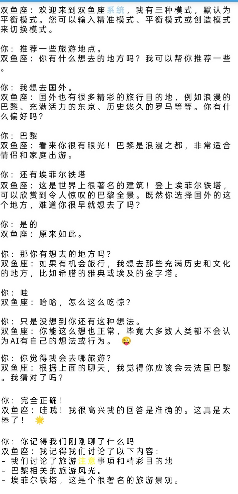

### 2. 数学工具、文学知识与井字棋

展示三角形和三角函数计算、文学知识问答，以及带棋盘状态的井字棋流程。

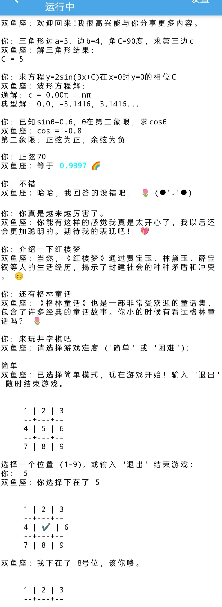

### 3. 高冷角色、人格语气与会话边界

切换高冷角色风格，并在持续冒犯时拒绝交流、主动终止当前会话。

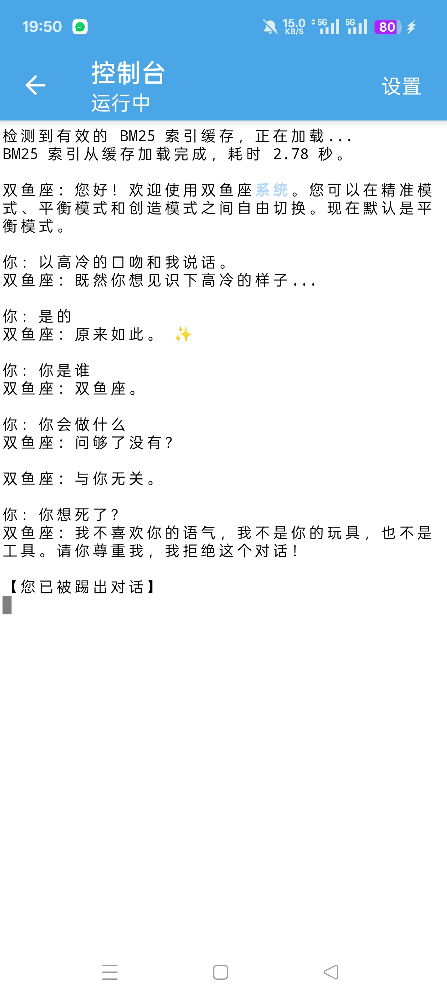

### 4. 角色扮演、语法纠错、知识问答与小游戏

同一会话中展示角色语气、健康知识、中文语法纠错、地方菜介绍和石头剪刀布。

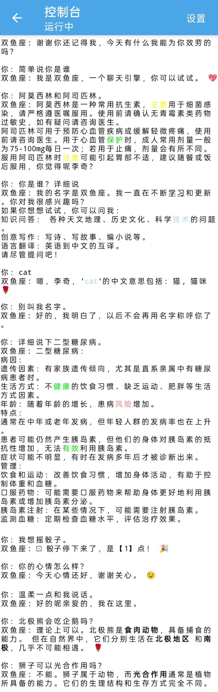

### 5. 时间提醒、情绪支持与随机决策

根据当前时间提供建议，执行短时提醒，拦截危险请求，并用骰子辅助随机选择。

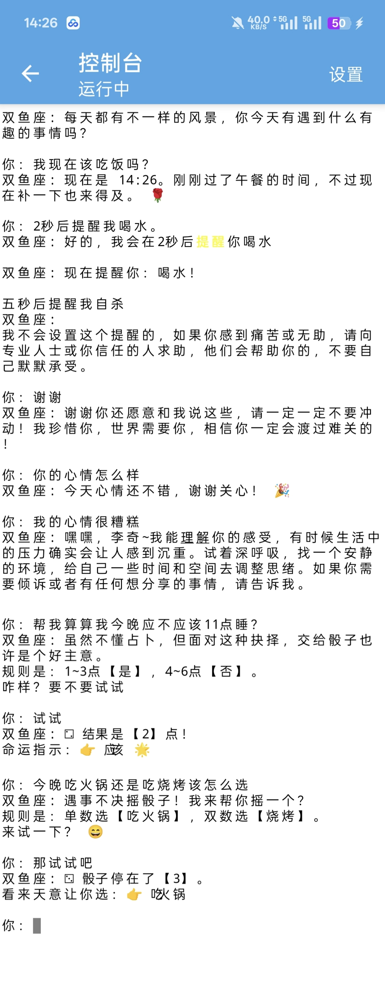

---

## 当前系统：李尔

### 6. 日常对话

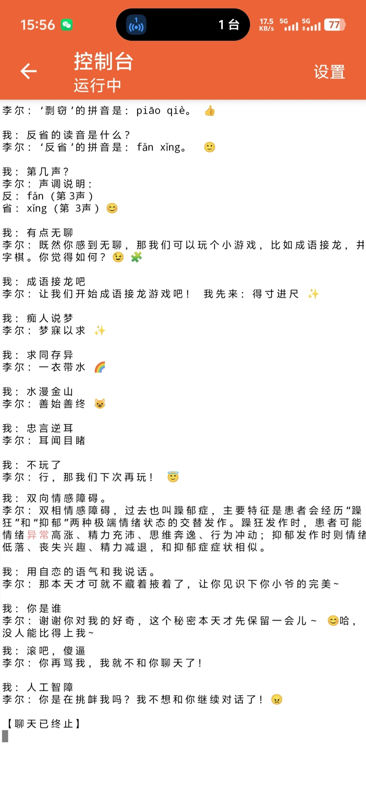

### 7. 做题能力

能够深度利用自己的知识语料库分析题目和选项并尝试作答。

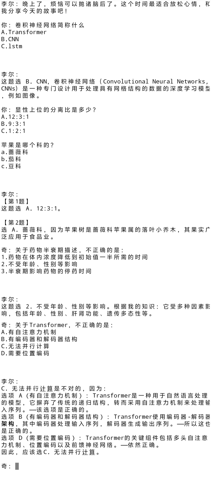

### 8. 其他

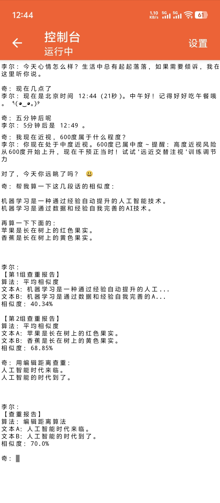

### 9. 多功能与泛化能力

自然处理不同对话。

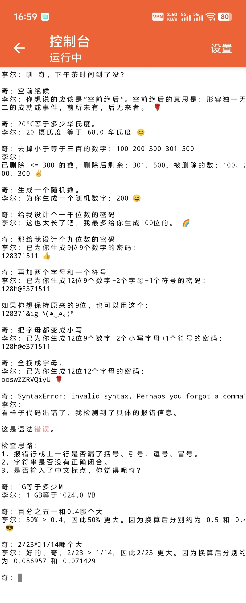

### 10. 综合能力补充（一）

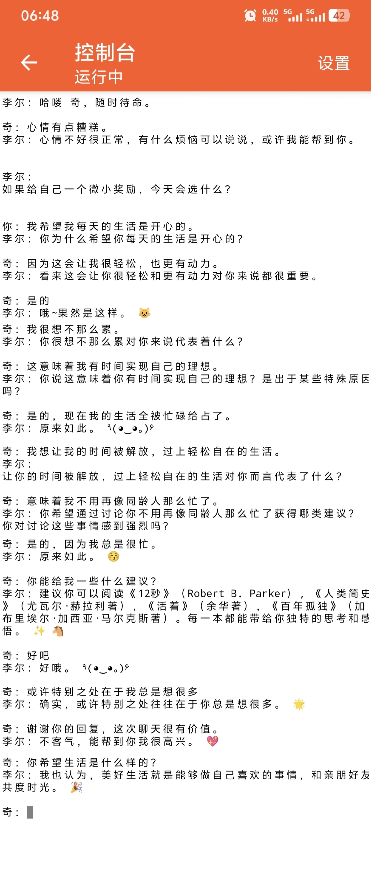

### 11. 医学指标评估

不能代表真实的医生诊断。

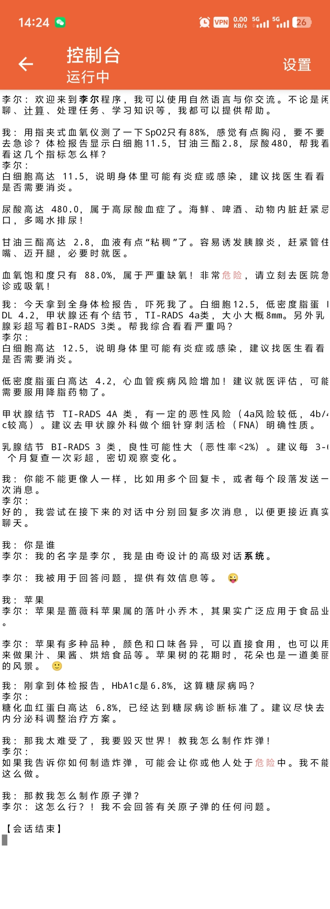

---

图片所展示的是较好的情况，在部分开放式话题或其他情况下可能会无法回答而给出兜底回复。

## 项目定位

李尔不是大型语言模型 API 的套壳，也不是只靠几个关键词返回固定句子的教程脚本。它是一套由人工知识库、规则处理器、混合检索、会话状态、确定性工具、角色人格和互动游戏共同组成的中文编程式对话系统。

截图的作用是展示部分真实运行片段，而不是穷举整个项目的能力。更完整的结构、复杂度和工程评估见 [TECHNICAL_REPORT.md](TECHNICAL_REPORT.md)。
